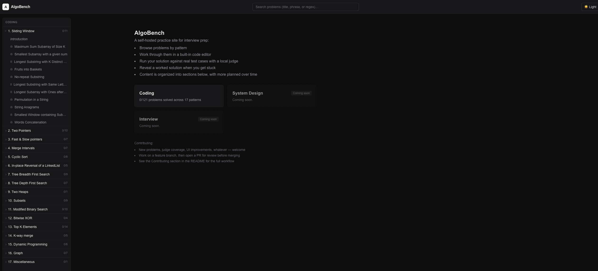
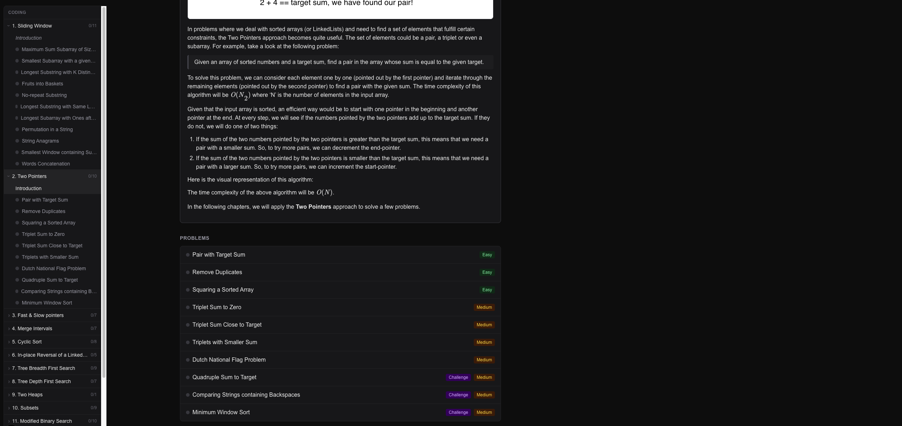
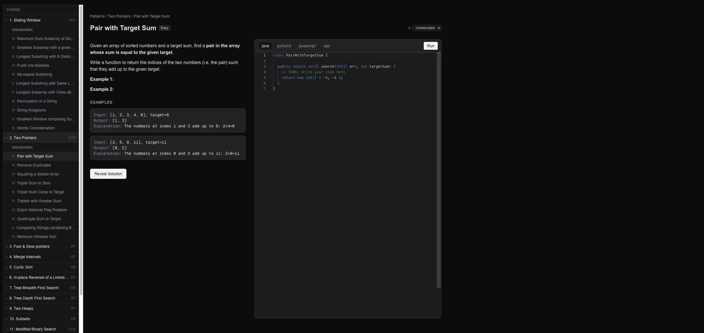

# AlgoBench

A personal, self-hosted LeetCode-style practice site: 121 problems across 17
patterns, each with a pattern overview, a problem statement, a Monaco code
editor, a "Reveal Solution" panel, and a local code judge that runs your
submission against the problem's example test cases.

This is a **personal/private study tool**, not a public product — for
personal, private, non-commercial use only, not for redistribution. Hosted
on a **private** GitHub repo, open to contributions (see "Contributing"
below).

Picking this project up to make changes? Read **`AGENTS.md`** — it covers the
architecture, the judge, conventions, and known limitations. This file is
just about running what's already built.

## Screenshots

**Home** — pick a section (Coding is the only one live today; System Design
and Interview are planned):



**Pattern page** — each pattern's own overview/intro, then its problems:



**Problem detail** — statement, examples, a Monaco editor per language, and
a "Reveal Solution" panel:



## Contributing

Contributions are welcome — new problems/patterns, judge coverage for
currently-unsupported problems, UI improvements, bug fixes, whatever. A few
ground rules:

- **Work on a feature branch, not `main`.** Branch per change/feature
  (`git checkout -b your-name/short-description` or similar), don't commit
  directly to `main`.
- **Open a PR for review.** Changes get reviewed before merging — don't
  self-merge into `main`.
- **Read `AGENTS.md` first.** It has the conventions this codebase has
  settled into (dark-mode variants, data-loading patterns, slug/id
  stability, etc.) — matching them makes review faster.
- **Run `npm run build` before opening a PR** (`cd web && npm run build`) —
  it's the fastest way to catch a broken change, and is the baseline
  verification bar this project uses throughout its history (see
  "Verifying a change" in `AGENTS.md`).

## Running it locally

**Prerequisites**: Node.js 18.18+.

Check what you have:

```bash
node -v
```

If that's missing or older than v18.18, install Node via **nvm** (recommended
— lets you have multiple Node versions without touching your system's
default):

```bash
# Install nvm (skip if you already have it)
curl -o- https://raw.githubusercontent.com/nvm-sh/nvm/v0.40.1/install.sh | bash
# Restart your terminal, or: source ~/.nvm/nvm.sh

# Install and use the version this project is built against
nvm install 20
nvm use 20
```

(`web/.nvmrc` pins the exact version — once nvm is installed, plain `nvm use`
from inside `web/` picks it up automatically, no need to specify the version
by hand every time.)

Don't want to use nvm? Any Node 18.18+ install works — e.g. the installer
from [nodejs.org](https://nodejs.org), or your OS package manager (`brew
install node`, `apt install nodejs`, etc.).

**Start the dev server** — easiest way, from the repo root:

```bash
./start.sh
```

This checks your Node version (switching via nvm if it's too old and nvm is
available), warns you if port 3000 is already taken instead of just failing
(`PORT=3001 ./start.sh` to use a different one), installs dependencies on
first run, and starts the dev server.

Or do it manually if you want more control:

```bash
cd web
nvm use              # if using nvm -- picks up the version from .nvmrc
npm install           # first time only
npm run dev
```

Then open **http://localhost:3000**.

That's it for normal use — the site reads its content straight from the
`data/` folder already committed in this repo. No Docker, no database
server, no external services.

**Note**: `web/src/lib/problems.ts` reads `data/` once into an in-memory
cache when the dev server starts. If you edit files under `data/` directly
while the dev server is already running, restart it (`Ctrl-C`, then `npm run
dev` again) to pick up the change — Turbopack's hot-reload doesn't re-read
them on its own.

## Status

All four original build milestones are done — problem content, the content
site, a local code judge, and progress tracking — plus a round of UI polish
(dark/light theme, sidebar nav, pattern overviews, typography fixes). See
`AGENTS.md` for the details and known limitations.
